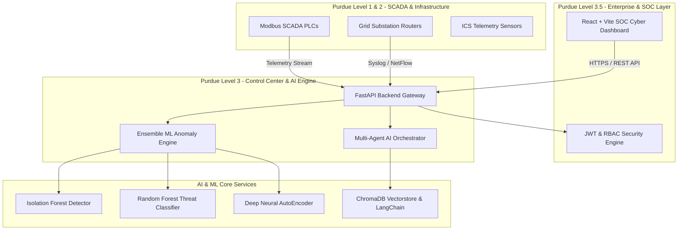

# System Architecture — CNI AI Cyber Resilience Platform

## System Overview

The **CNI AI Cyber Resilience System** implements a zero-trust, multi-agent AI architecture designed specifically for high-consequence Critical National Infrastructure (CNI) environments operating on the **Purdue Model for Industrial Control Systems (ICS)**.

## AI & ML Pipeline Breakdown

1. **Isolation Forest Model**: Evaluates high-dimensional network telemetry features `[source_port, dest_port, packet_length, failed_logins, byte_rate, off_hours, protocol]` to flag unsupervised statistical outliers.
2. **Random Forest Threat Classifier**: Classifies incoming telemetry anomalies into specific attack categories (`Normal`, `DDoS`, `SCADA_Command_Injection`, `Insider_Threat`, `Buffer_Overflow`).
3. **Deep Neural AutoEncoder**: Computes reconstruction error ($MSE = \frac{1}{n}\sum(x - \hat{x})^2$) to detect zero-day protocol anomalies in Modbus TCP and DNP3 packet payloads.
4. **LangChain Multi-Agent Framework**: Coordinates 8 specialized AI agents with ChromaDB RAG vector search across CERT-In advisories, MITRE ATT&CK for ICS, and NIST SP 800-82 guidelines.
