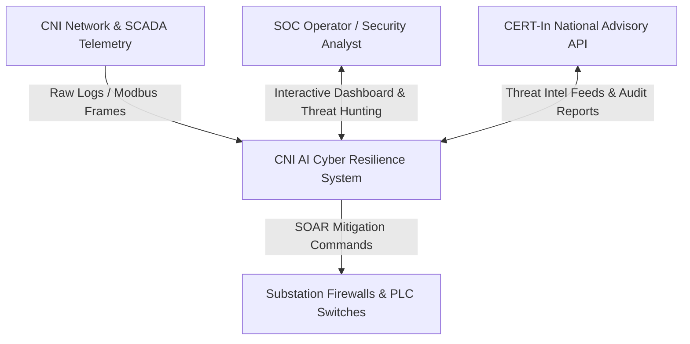
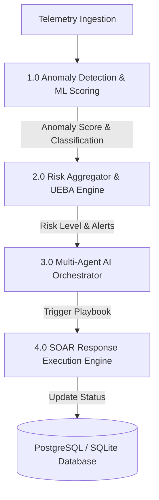

# Data Flow Diagrams (DFD) — Level 0, 1, 2

## DFD Level 0 (Context Diagram)

```mermaid
graph TD
    CNI_Sensors[CNI Network & SCADA Telemetry] -->|Raw Logs / Modbus Frames| Platform[CNI AI Cyber Resilience System]
    SOC_Analyst[SOC Operator / Security Analyst] <-->|Interactive Dashboard & Threat Hunting| Platform
    CERT_In[CERT-In National Advisory API] <-->|Threat Intel Feeds & Audit Reports| Platform
    Platform -->|SOAR Mitigation Commands| SCADA_Actuators[Substation Firewalls & PLC Switches]
```

## DFD Level 1 (Process Decomposition)

```mermaid
graph TD
    InboundLogs[Telemetry Ingestion] --> P1[1.0 Anomaly Detection & ML Scoring]
    P1 -->|Anomaly Score & Classification| P2[2.0 Risk Aggregator & UEBA Engine]
    P2 -->|Risk Level & Alerts| P3[3.0 Multi-Agent AI Orchestrator]
    P3 -->|Trigger Playbook| P4[4.0 SOAR Response Execution Engine]
    P4 -->|Update Status| DB[(PostgreSQL / SQLite Database)]
```
