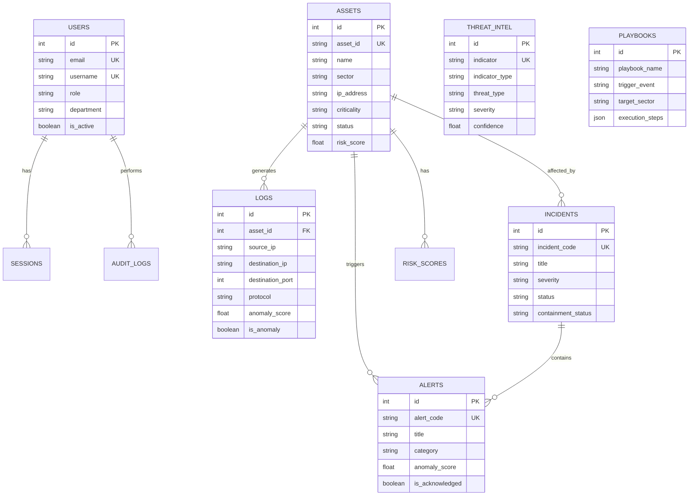

# Entity Relationship (ER) Diagram

```mermaid
erDiagram
    USERS ||--o{ SESSIONS : has
    USERS ||--o{ AUDIT_LOGS : performs
    ASSETS ||--o{ LOGS : generates
    ASSETS ||--o{ ALERTS : triggers
    ASSETS ||--o{ INCIDENTS : affected_by
    ASSETS ||--o{ RISK_SCORES : has
    INCIDENTS ||--o{ ALERTS : contains

    USERS {
        int id PK
        string email UK
        string username UK
        string role
        string department
        boolean is_active
    }

    ASSETS {
        int id PK
        string asset_id UK
        string name
        string sector
        string ip_address
        string criticality
        string status
        float risk_score
    }

    LOGS {
        int id PK
        int asset_id FK
        string source_ip
        string destination_ip
        int destination_port
        string protocol
        float anomaly_score
        boolean is_anomaly
    }

    THREAT_INTEL {
        int id PK
        string indicator UK
        string indicator_type
        string threat_type
        string severity
        float confidence
    }

    INCIDENTS {
        int id PK
        string incident_code UK
        string title
        string severity
        string status
        string containment_status
    }

    ALERTS {
        int id PK
        string alert_code UK
        string title
        string category
        float anomaly_score
        boolean is_acknowledged
    }

    PLAYBOOKS {
        int id PK
        string playbook_name
        string trigger_event
        string target_sector
        json execution_steps
    }
```
